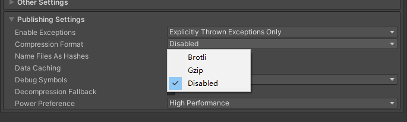
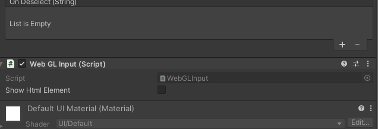

## 问题记录

### 压缩格式



本地运行时可能无法识别Gzip,Brotli加密格式的文件，如果使用的时`http`的话使用`Disabled`不压缩。


### InputFiled 无法输入中文，无法复制,粘贴剪贴板的内容

解决方案： 使用一个插件[WebGLInput](github.com:kou-yeung/WebGLInput)

使用方法： 在挂载`InputFiled`组件的物体上挂载插件的`WebGlInput`组件即可



导出后可能遇到点击输入框报错

> An error occurred running the Unity content on this page.See
> your browser JavaScript console for more info.The error was:
> TypeError:Cannot read properties of null (reading
> getElementsByTagName')

解决方案：

```
WebGl.framework.js 中搜索container.getElementsByTagName("canvas")
改为document.getElementsByTagName("canvas")
```

