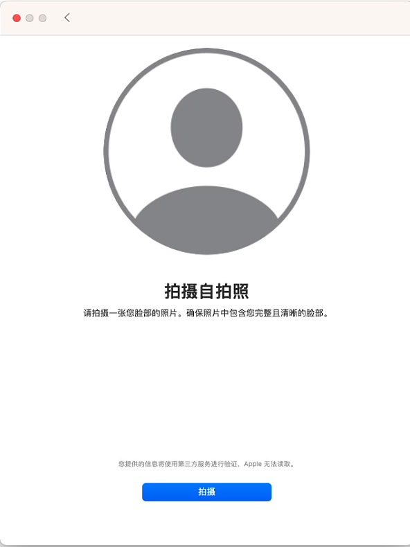
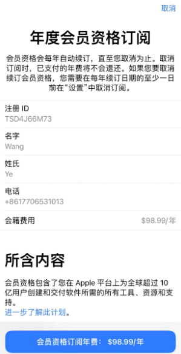
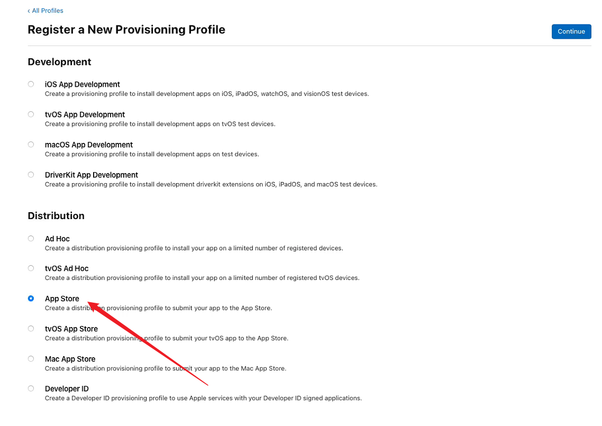

# 上架appstore流程

## 一、注册账户

[苹果开发者网站](https://developer.apple.com/)注册成为苹果开发者

## 二、注册会员

在`appstore` 中下载 `Apple Developer App`应用进行注册申请。

> 如果之前下载过，无法正常更新`需要登录iTurns store`的情况。 把原来的卸载掉重新下载一遍就不会提示登录iTurn Store了。

这一步结束后要填写电话或者邮件等待苹果官方联系你继续后续步骤。

在`Apple Developer `中点击账户，点击开始注册

注册注意要填写和身份证一致的信息

第一次注册后，苹果会给你发送邮件，需要按着要求回复

等身份验证通过了，在`App developer`中继续

这里显示的是美元价格，实际价格为688人民币。 

注意： 默认是开启自动续费的，需要关闭的要在`appsote` 账户中把订阅关掉。

购买成功后，在官网查看账户提示需要等待处理

等待回复邮件，验证身份证

## 三、申请证书、ID

### 创建ID

### 在Xcode端自动生成证书，不需要在管理后台添加证书

> 1. **Apple Development**：
>    - 用于在开发过程中的测试和调试。这个证书允许开发者在真实设备上安装和运行应用程序。
>    - 替代了旧的"iOS Development"证书。
> 2. **Apple Distribution**：
>    - 用于发布应用至App Store或分发给最终用户。
>    - 替代了旧的"iOS Distribution"证书。

> 然后到后面就看到自动创建的证书了

## 四、申请生成配置文件

### 开发环境配置文件

### 生产环境配置文件

## 五、

## 六、unity打包ios

如果项目接入了Firebase需要注意

- Firebase的配置文件名称一定不要搞错，iOS中为`GoogleService-Info.plist`，android中为`google-services.json`

- 不要直接打开`.xcodeproj`，要打开`xcworkspace`进行打包

  - 

- 

### 证书问题整理：

####  provisioning profile doesn't include signing certificate

> 笔者打开项目莫名就出现的(前一天还好好的)。  解决方案把证书从apple后台中删除，钥匙串中的也删除全部重新生成解决的。

####  Could not launch “Runner” Domain: IDEDebugSessionErrorDomain Code: 3

> 笔者是使用adhot证书打包时遇到的，[参考原因](https://stackoverflow.com/questions/66741621/could-not-launch-runner-domain-idedebugsessionerrordomain-code-3)
>
> 问题出在代码签名上。您的应用程序使用错误的配置文件进行签名，并且不允许 Xcode 将调试器附加到应用程序。例如，如果您想将调试器附加到使用 AdHoc 配置文件签名的应用程序，您可以在设备上安装并运行您的应用程序，但无法调试它（附加调试器）。如果您想将调试器附加到您的应用程序，则需要使用使用开发配置文件签名的应用程序。检查项目的签名设置，并确保您使用开发配置文件来签名应用程序。
>
> 总结：使用adhot打包的话，需要把数据线拔掉后手机真机调试。

## 六、上架

## 1、测试版上传蒲公英托管平台或直接打包到手机

## 2、正式版上传App Store

## 七、填写上架信息

### 进入App Store Connect创建应用才可以上传

> 入口：[https://developer.apple.com/acc](https://link.zhihu.com/?target=https%3A//developer.apple.com/account)

**主要语言**：决定了 App 在 App Store 上展示时使用的默认语言。后续可以修改，无需担心。

### 开始上传到App Store Connect

## 八、完善其他信息

