# Appstore内购接入流程

## 一、准备工作

## 1.注册开发者账号

参考[第一篇1-上架appstore](1-上架appsotre流程.md)

## 2.填写税务，协议，银行业务相关信息

> 注：填写通过后可以才可以获取到商品列表，否则获取不到

### 在appstoreconnect中心找到协议、税务和银行业务

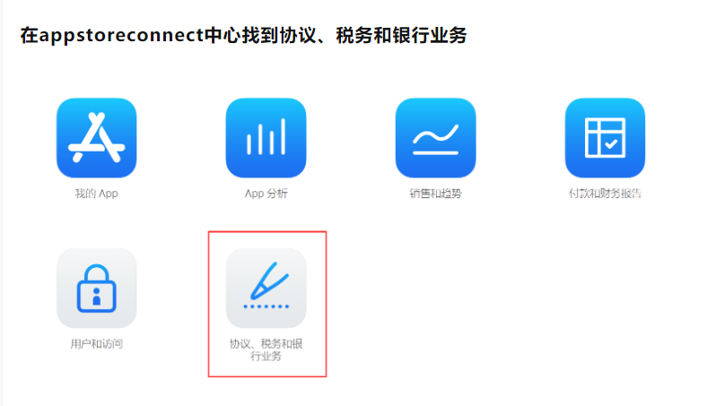

点击进入协议、税务和银行业务 版块，进行下一步的申请

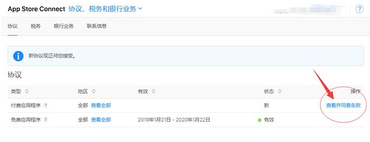

可以看到，默认的【免费应用程序】是和账号的到期时间是一致的！

而【付费应用程序】则需要“同意条款”

点击右侧“查看并同意条款

### 在弹出界面输入您的真实联系地址

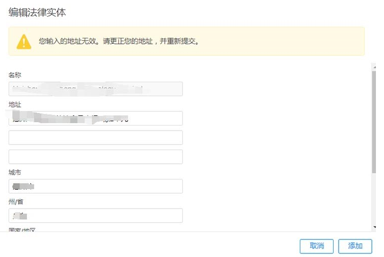

该地址信息请您认真并真实填写！

提示：地址必须是全英文，可以是拼音，如果地址太长可以分2行填写

（注意：这里名称和地址总是报错，说什么参数太长，要注意修改下，之前减少了很多，都不行，后来又突然可以了）

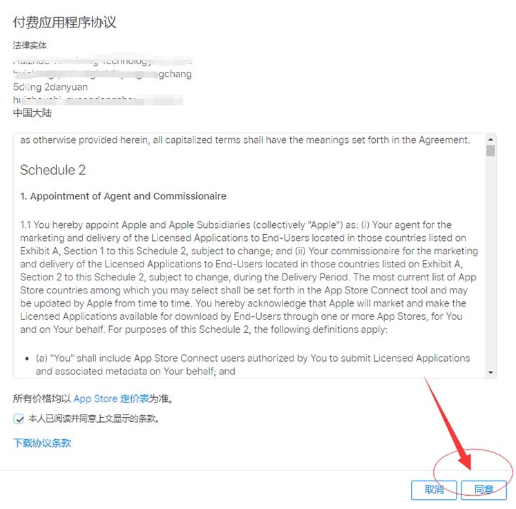

点击【同意】完整地址信息提交！

### 地址信息更新之后，跟着设置“税务、银行业务和联系信息”

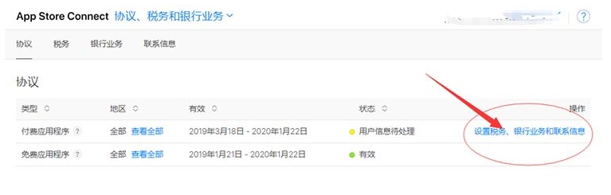

点击右侧【税务、银行业务和联系信息】进入设置页面

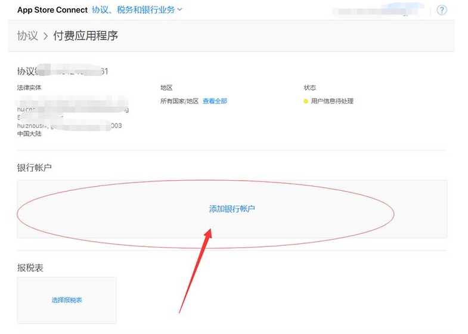

在设置页面，点击添加【银行账号】

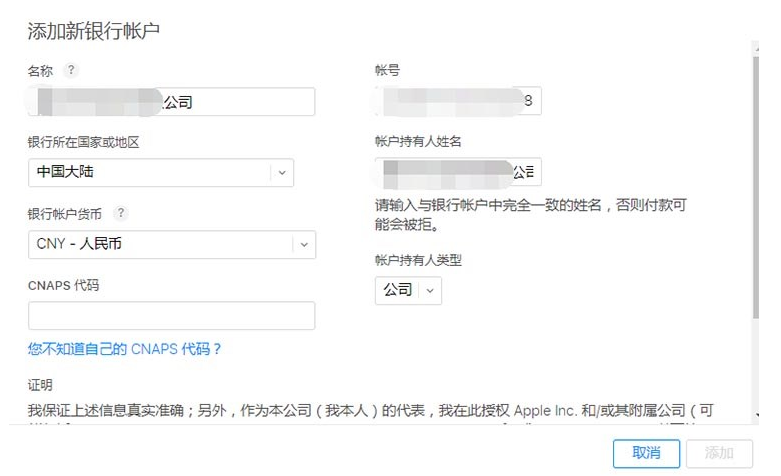

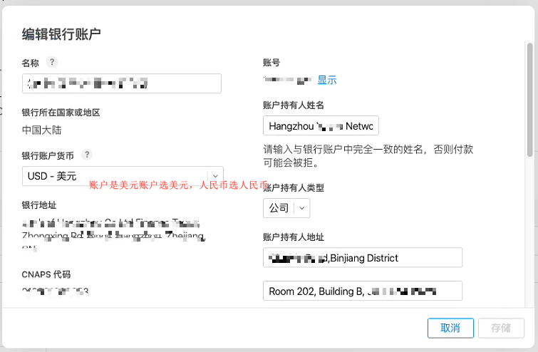

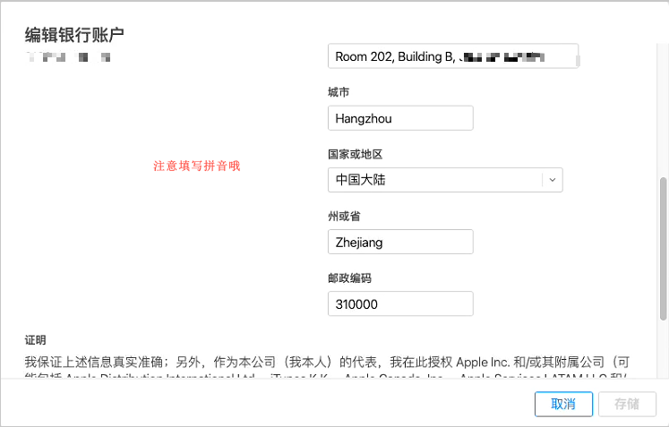

>温馨提示：个人用户在账户持有人姓名哪里输入拼音；公司用户输入邓白氏编码一致的公司英文名！
>按照自己的真实信息填写，公司就写公司，个人就写个人！
>这里需要一个CNAPS，是大陆地区每个银行的银联收款号，请电话至您账号的开户行询问！
>当然也可以在线查询！前提是你知道自己的开户行详细信息！
>
>强烈建议：还是建议电话至开户行询问银联12位编码（支付系统行号）！
>
>[在线查询](https://www.lianhanghao.com/)

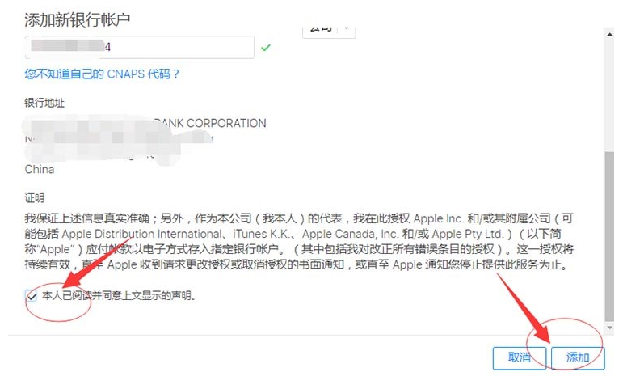

输入信息齐全之后，下拉，勾选协议，点击右侧【添加】即可完成

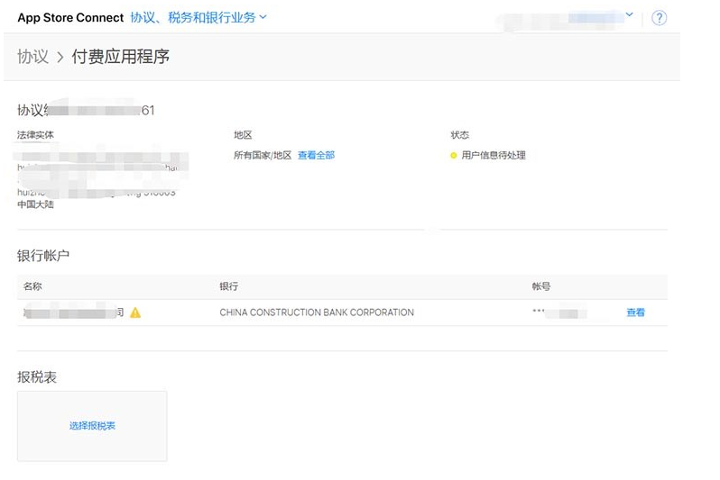

如图，银行信息就设置好了。

### 设置税务协议，美国税务协议！

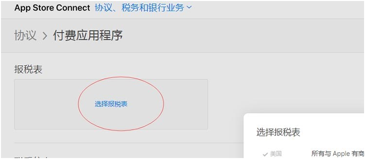

直接点击【完成】选择美国协议！

当然如果你账号是以下三个国家或中国台湾省的，可以单独勾选，独立填写！

您是否被视为美国税务居民 (U.S. Tax Resident) ？

一般来说，如果您符合以下条件，则您可被视为美国居民：(1) 在本日历年的任何时间，根据美国移民法，您是美国合法永久居民，该身份未撤销，且未从行政或司法角度认定为已放弃该身份；或者 (2) 您在本年度内至少在美国实际居留 31 天，在包含本年度及前两年在内的总计 3 年期内在美国实际居留至少 183 天。点按此处进一步了解“美国居民”的定义。

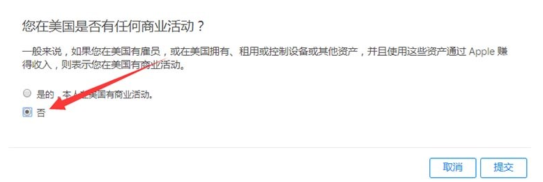

您在美国是否有任何商业活动？

一般来说，如果您在美国有雇员，或在美国拥有、租用或控制设备或其他资产，并且使用这些资产通过 Apple 赚得收入，则表示您在美国有商业活动。

直接选择【否】即可点击【提交】

### 填写详细税务协议单

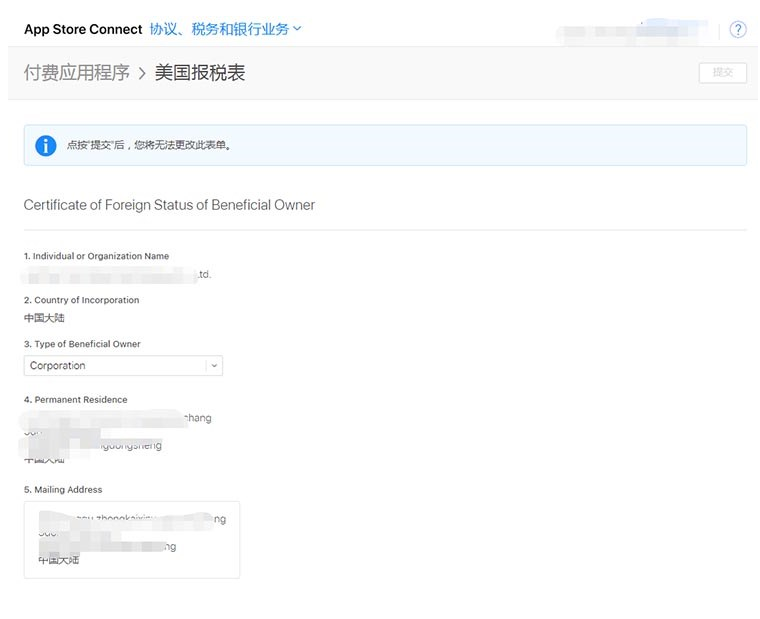

Certificate of Foreign Status of Beneficial Owner

受益所有人的外国身份证明

1. Individual or Organization Name
   个人或公司组织名 系统默认
2. Country of Incorporation
   地区或国家 系统默认 中国大陆
3. Type of Beneficial Owner

受益人类型 自行选择，公司就选公司，个人选个人

1. Permanent Residence

常住地 系统默认（如不正确，请在第一项地址里面修改）

1. Mailing Address

邮寄地址 系统默认 （如不正确，请在第一项地址里面修改）

Certification
I declare that the individual or organization named above is the beneficial owner of any payments made under the agreement. I declare that the beneficial owner does not have any employees in the United States and does not own, lease, or control any equipment or other assets in the United States that are used to derive revenue from Apple. I declare that I am either the beneficial owner or that I am authorized to make this declaration on behalf of the beneficial owner.
Name of Person making this Declaration

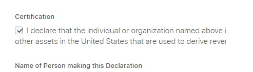

以上信息正确，请注意勾选此处协议！

Title ：输入框

—— 职位签名，英文名 +CEO 总经理 …

W-8BEN-E 代用表
Certificate of Status of Beneficial Owner for United States Tax Withholding and Reporting (Entities) (Rev. July 2017)

我们建议您在填写 W-8BEN-E 代用表之前先查看 W-8BEN-E 代用表提示页和 W-8BEN-E 报税表说明。

如果您之前提交过 W-8BEN-E 代用表，则您现在填写的 W-8BEN-E 代用表将替换并取代您之前提交的 W-8BEN-E 代用表。

如果您是合伙公司，并且希望通过 Apple Developer Program 申请与您的收入相关的协定利益，请参阅有关提交更新的税务信息的常见问题解答。

该部分可以全部留空！

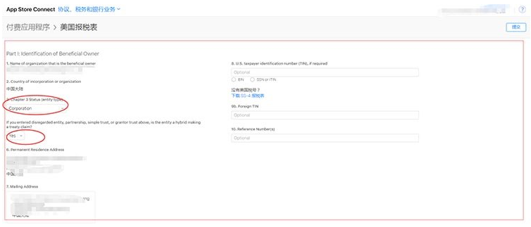

Part III: Claim of Tax Treaty Benefits (If Applicable). (For chapter 3 purposes only)
\14. I certify that (check all that apply)
The beneficial owner is a resident of China mainland within the meaning of the income tax treaty between United States and that country.
The beneficial owner derives the item (or items) of income for which the treaty benefits are claimed, and, if applicable, meets the requirements of the treaty provision dealing with limitation on benefits. The following are types of limitation on benefits provisions that may be included in an applicable tax treaty (check only one; see instructions):
Type of limitation on benefits provisions

The beneficial owner is claiming treaty benefits for dividends received from a foreign corporation or interest from a U.S. trade or business of a foreign corporation and meets qualified resident status (see instructions).
\15. Special rate and Conditions
The beneficial owner is claiming the provisions of Article and paragraph
Optional
of the treaty identified on line 14a above to claim a
Optional
% rate of withholding on (specify type of income):

Income from the sale of applications
Other (please specify)
Optional

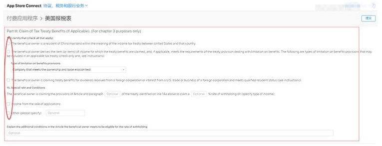

该部分可以全部留空！

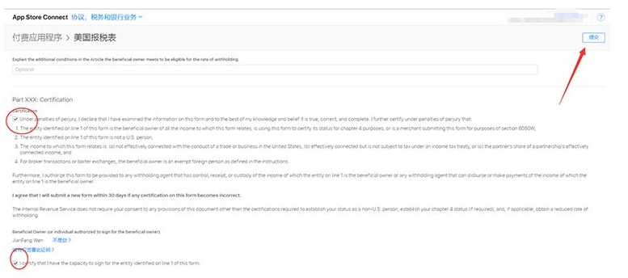

最后勾选协议，底部两处勾选，之后在顶部右边上角【提交】按钮，点击提交！

提交之后耐心等待1-3工作日，如果有特殊需求，苹果会邮件通知，根据邮件修改一下即可！

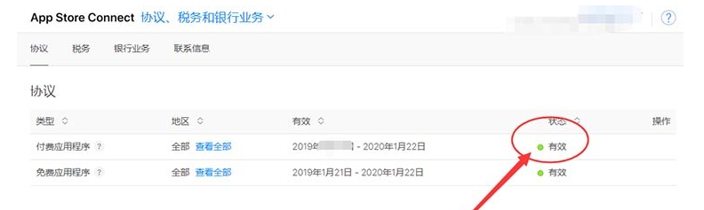

## 3.App 内购买项目配置流程

官方文档：https://help.apple.com/app-store-connect/?lang=zh-cn#/devb57be10e7

登录app store connect：https://appstoreconnect.apple.com/

### 从“我的 App”中，选择您的 App。

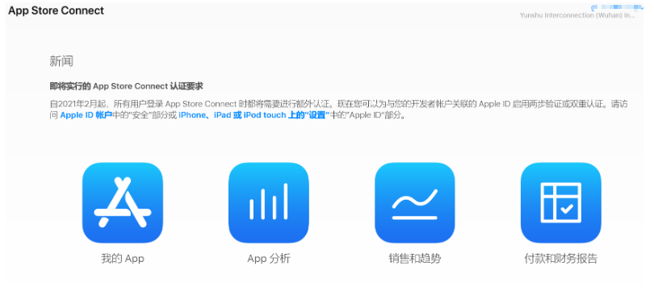

选择“消耗型项目”、“非消耗型项目”或“非续期订阅”，并点按“创建”。有关自动续期订阅的信息，请参见创建[自动续费订阅](https://developer.apple.com/help/app-store-connect/measure-app-performance/overview-of-reporting-tools)。

### 3.1 消耗型、非消耗型商品创建

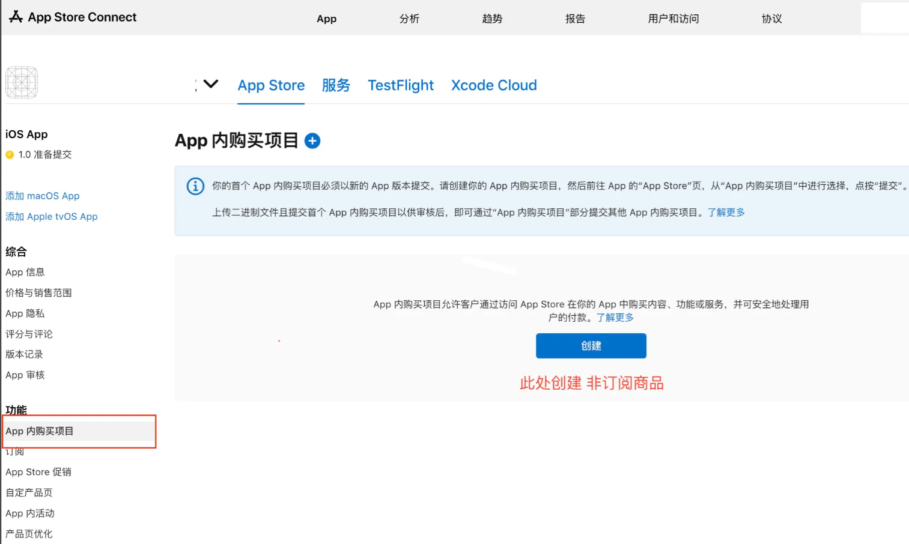

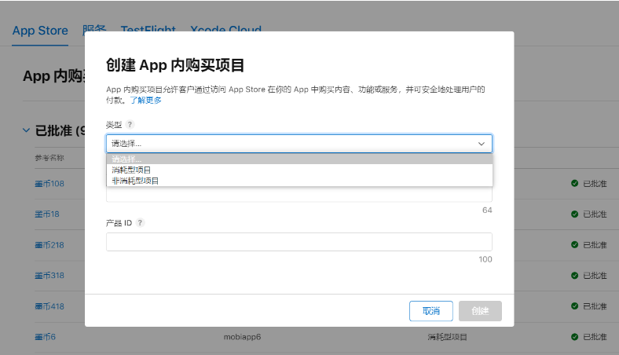

### 3.2 订阅型商品创建

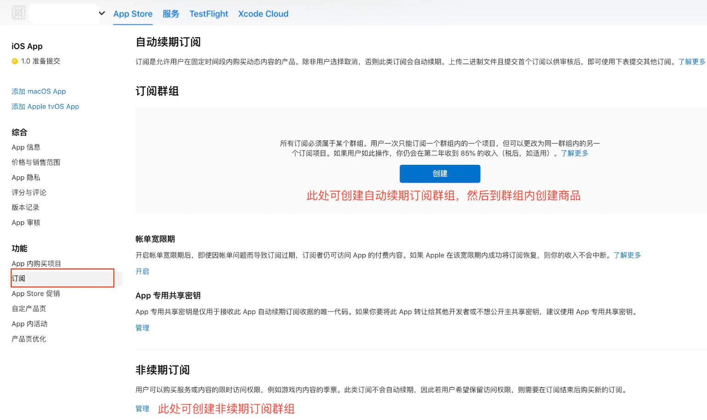

#### 3.2.1 自动续期订阅

**一个群组内的商品，支持升级降级订阅，同组内同时只会订阅一个商品。**

**比如说，组内有3个商品，1个月会员，6个月会员，1年会员，用户可以在这个组内升降级修改订阅商品，最终扣费以最后一个订阅的扣费。**

**N个组内的商品，可以同时订阅N个商品。**

| 订阅群组     | 组内商品            | 用户订阅的                            |
| ------------ | ------------------- | ------------------------------------- |
| 组A          | 商品A，商品B，商品C | 订阅A/B/C                             |
| 组B          | 商品E，商品F，商品G | 订阅E/F/G                             |
| 用户总共订阅 |                     | A/B/C 和 E/F/G 【同时订阅了两个商品】 |

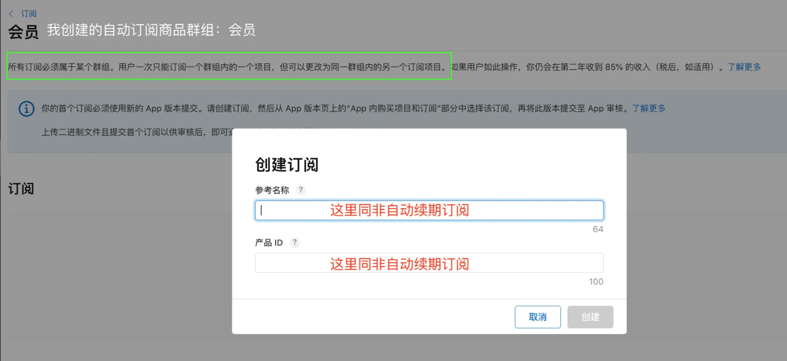

#### 3.2.2 自动订阅群组商品升降级说明

**在同一群组创建商品的时候，需要注意升降级跨级问题，从提供最高级别服务的选项开始，按降序排列你的订阅。**

| 商品等级升降 | 说明                                                         |
| ------------ | ------------------------------------------------------------ |
| 升级         | 从较低等级的订阅切换到较高等级的订阅时，用户先前的 App 内购买项目金额将会按比例退还到原始付款方式。新的 App 内购买项目将收取完整价格并立即生效，用户的续期日期也随之更改为升级日期。 |
| 降级         | 用户从较高等级的订阅切换到较低等级的订阅时，在下一个续期日期，会以新费率向用户收费。 |
| 跨级         | 在相同等级的订阅间进行切换时，如果 App 内购买项目的时限相同，那么用户先前的 App 内购买项目金额将会按比例退还到原始付款方式。新的 App 内购买项目将收取完整价格并立即生效，用户的续期日期也随之更改为升级日期。如果 App 内购买项目的时限不同，那么跨级将会在用户的下一个续期日期生效。 |

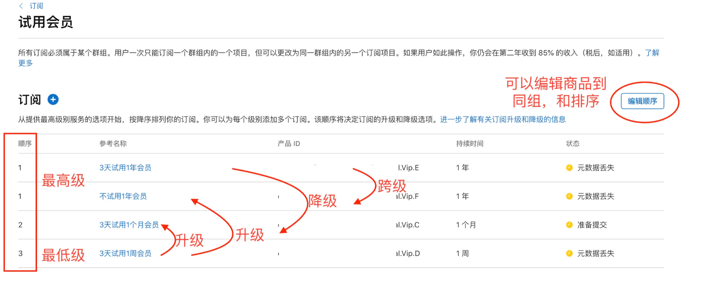

举个栗子：

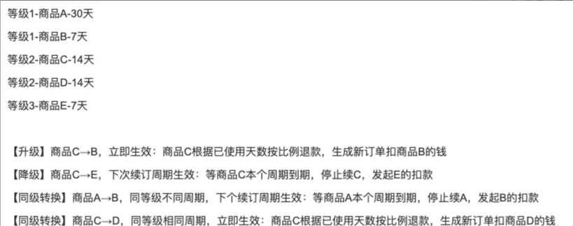

#### 3.2.3 非自动续期订阅

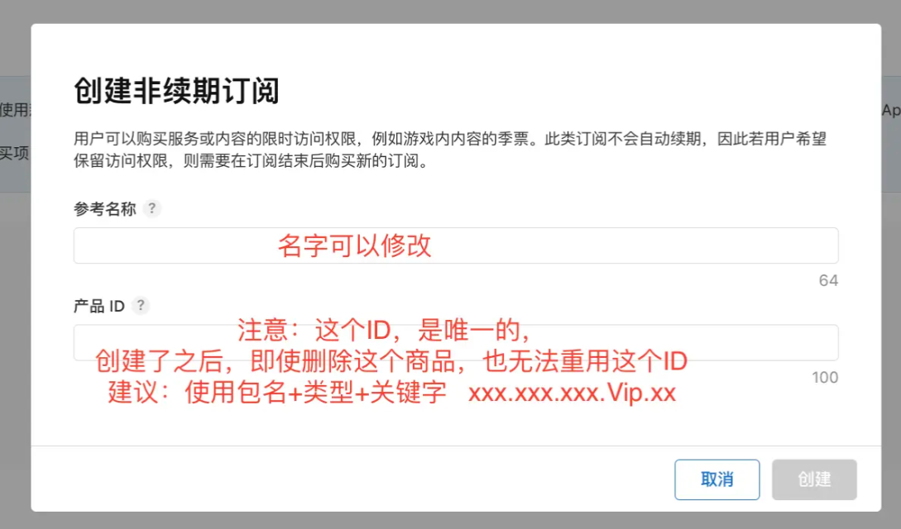

### 3.3 商品详细信息编辑

>  无论是订阅还是App内购项目都需要完善商品详细信息

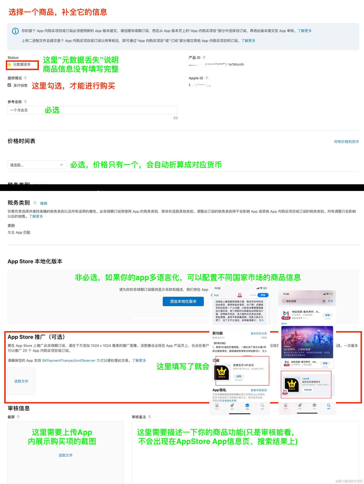

全部填写完成后点击右上角的存储

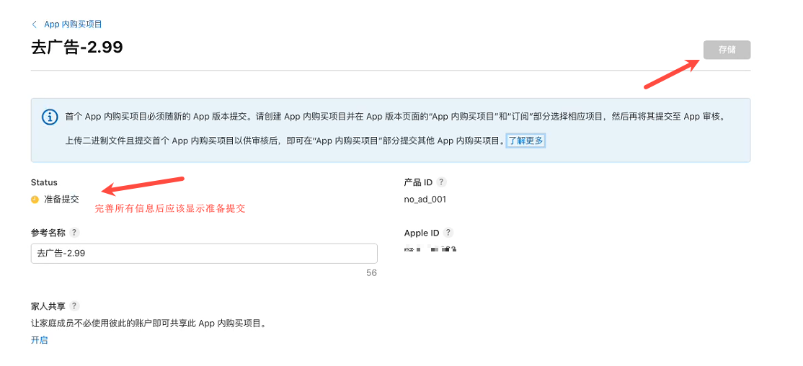

点按“存储”或“提交以供审核”。

您可以在创建您的 App 内购买项目时输入所有的元数据，或稍后输入您的 App 内购买项目信息。

> 注意：创建app内购买项目时有时候会报`元数据缺失`的问题，这时候点进去看下，缺什么数据：一般是价格和审核图片忘记传，填上即可。

创建完之后，一个价格就对应一个产品ID，这个产品ID就是后面你写代码需要用到的。

配置完app内购买项目之后，还有提交 App 内购买项目：https://developer.apple.com/help/app-store-connect/manage-submissions-to-app-review/submit-for-review

## 4.配置沙箱测试账号

沙盒环境说明：

1、必须是真实设备才能测试内购，模拟器不行；

2、如果设备安装的是adhoc包，xcode直接run的包，测试时需要登录沙盒测试员账号进行购买，审核人员审核时候的支付也都是使用沙盒环境（此处关系到验签）。

3、TestFlight里安装的包，也是使用沙盒环境，但是使用真实的Apple ID进行购买，不会扣钱。

#### 4.1、增加沙盒人员

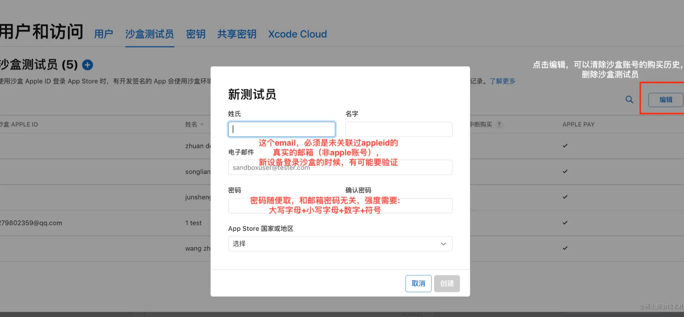

#### 4.2、清除购买历史，删除沙盒人员

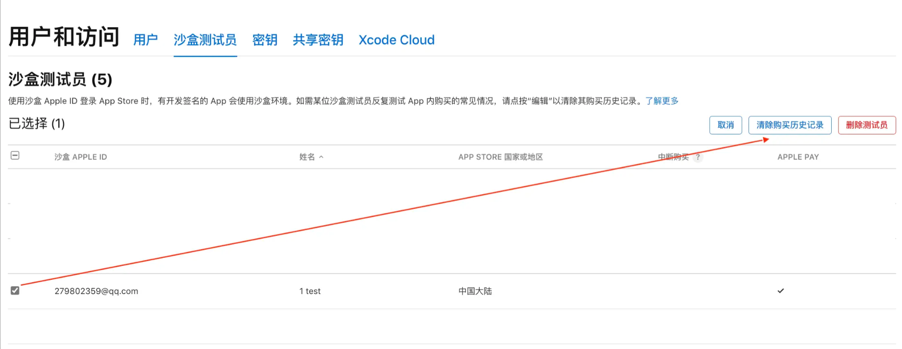

#### 4.3、修改自动续期测试时间

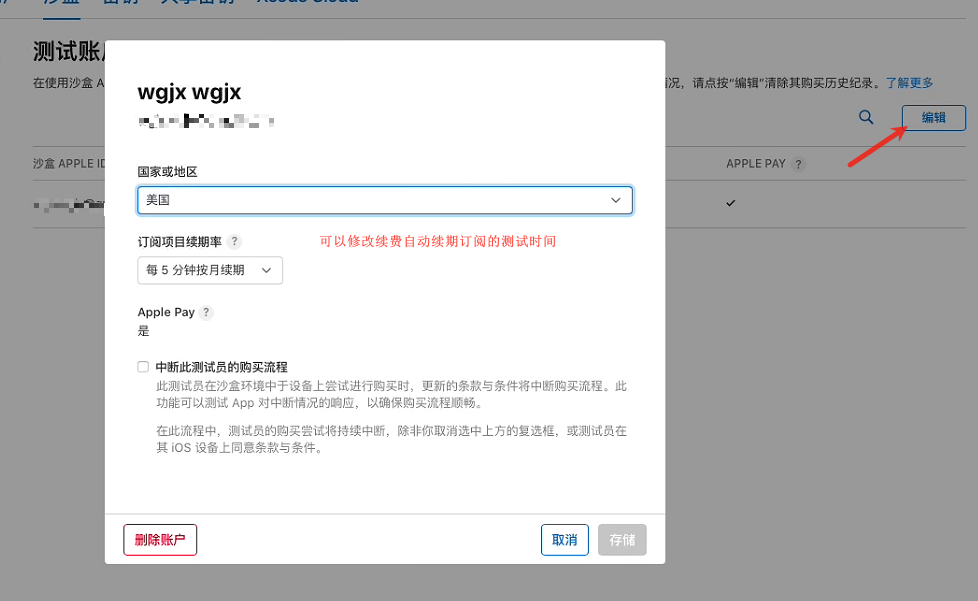

## 5.配置服务器通知地址

 **配置好服务端与苹果交互的回调地址，才能实现支付流程服务端与苹果的通讯，比如：购买验单回调，订阅续订回调，退款回调。**

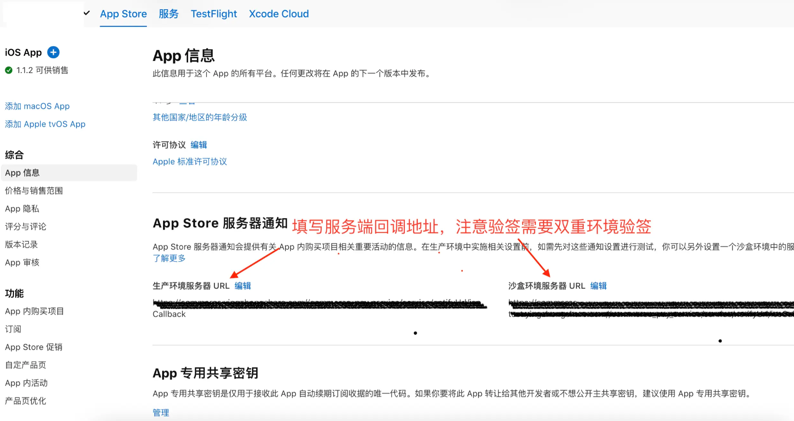

## 二、具体实现

## 1.非订阅型购买流程概览

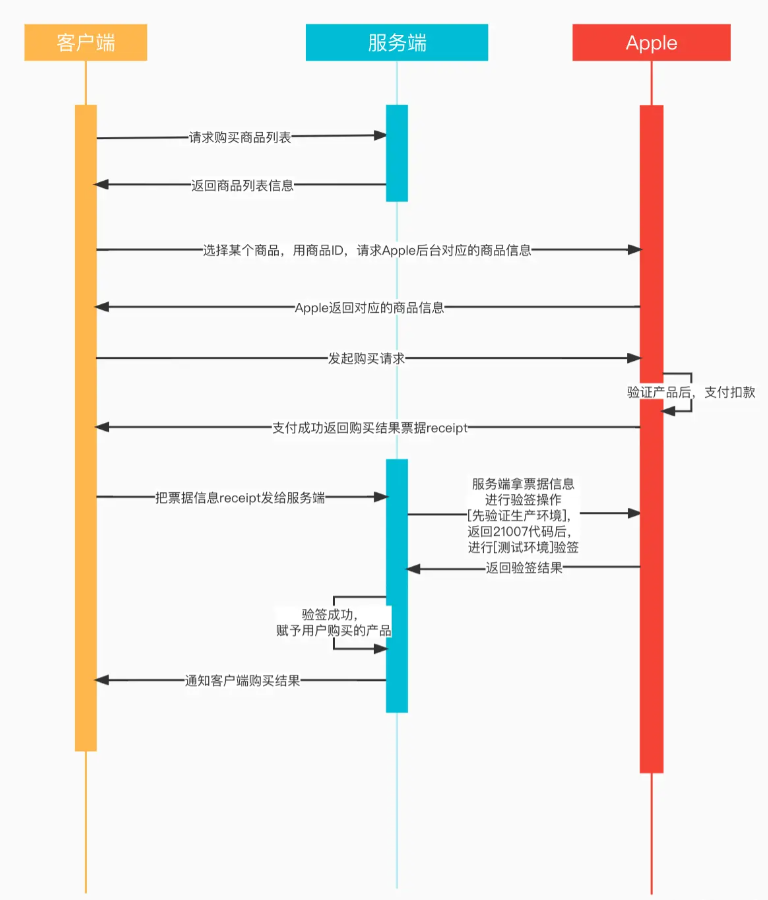

## 2. 自动续期型购买流程概览

**注意：首次订阅，客户端会上传receipt data给服务端，进行验单；同时Apple也会有一个订阅成功的回调到服务端，成功处理一个即可，不要重复赋予权益。**

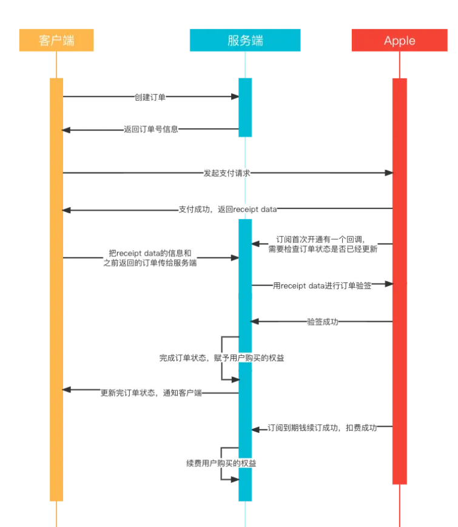

## 3.订单凭证验签

**订单凭证验签成功与否，决定此次购买的结果。**

**注意：为了保证不影响审核，服务器验签需要使用双重验证。优先验证生产环境，返回错误代码21007后，进行测试环境验签。**

### **3.1、Apple验签地址**

沙盒测试：[sandbox.itunes.apple.com/verifyRecei…](https://link.juejin.cn/?target=https%3A%2F%2Fsandbox.itunes.apple.com%2FverifyReceipt)

正式：[buy.itunes.apple.com/verifyRecei…](https://link.juejin.cn/?target=https%3A%2F%2Fbuy.itunes.apple.com%2FverifyReceipt)

### **3.2、凭证receipt data参数预览**

[Apple官方文档的参数解释](https://link.juejin.cn/?target=https%3A%2F%2Fdeveloper.apple.com%2Flibrary%2Farchive%2Freleasenotes%2FGeneral%2FValidateAppStoreReceipt%2FChapters%2FReceiptFields.html%23%2F%2Fapple_ref%2Fdoc%2Fuid%2FTP40010573-CH106-SW12)

| 参数                       | 说明                                                         | 备注                                                         |
| -------------------------- | ------------------------------------------------------------ | :----------------------------------------------------------- |
| environment                | 支付环境：沙盒、非沙盒                                       |                                                              |
| transaction_id             | 交易凭证ID                                                   |                                                              |
| original_transaction_id    | 原始交易凭证ID                                               |                                                              |
| quantity                   | 购买数量                                                     |                                                              |
| product_id                 | 商品ID                                                       |                                                              |
| is_trial_period            | 是否享用免费试用                                             |                                                              |
| is_in_intro_offer_period   | 是否享用首单优惠                                             | 订阅型商品有的                                               |
| auto_renew_status          | 订阅状态 1:续订中 0:关闭续期订阅                             | auto_renew_status=1 并且 is_in_billing_retry_period=1, 此时用户的状态并不能标记为已关闭, 而应该是扣费失败，仍在尝试订阅 |
| is_in_billing_retry_period | 自动续期订阅状态 1:尝试订阅 0:停止尝试订阅                   |                                                              |
| latest_receipt_info        | 自动续费订阅的所有收据凭证                                   |                                                              |
| pending_renewal_info       | 续订订单的状态信息                                           |                                                              |
| cancellation_date          | 退款的订单凭证                                               | 取消的应用内购买将无限期保留在收据中。仅适用于非消耗性产品、自动续订订阅、非续订订阅或免费订阅的退款。 |
| cancellation_reason        | 退款的原因 1:应用程序中的实际或感知问题客户取消了交易 0:交易因其他原因被取消,意外购买等 |                                                              |

### 3.3、验签错误码

| 错误码      | 说明                                                         | 备注 |
| ----------- | ------------------------------------------------------------ | ---- |
| 21000       | App Store无法读取你提供的JSON数据                            |      |
| 21002       | 收据数据不符合格式                                           |      |
| 21003       | 收据无法被验证                                               |      |
| 21004       | 你提供的共享密钥和账户的共享密钥不一致                       |      |
| 21005       | 收据服务器当前不可用                                         |      |
| 21006       | 收据是有效的，但订阅服务已经过期。当收到这个信息时，解码后的收据信息也包含在返回内容中 |      |
| 21007       | 收据信息是测试用（sandbox），但却被发送到产品环境中验证      |      |
| 21008       | 收据信息是产品环境中使用，但却被发送到测试环境中验证         |      |
| 21010       | 此收据无法授权。                                             |      |
| 21100-21199 | 内部数据访问错误                                             |      |

## 4、恢复购买

**注意：恢复购买是针对【非消耗型】【自动续期订阅型】商品的。在客户端获取可恢复购买商品列表的时候，会返回该Apple ID购买过的【非消耗型】【自动续期订阅型】商品。其他类型商品，需要自己维护用户新旧设备、多个设备的权益同步。**

**适用场景：假如用户在iPhone A购买了永久会员，然后换了新手机iPhone B，两台设备登录了同一个Apple ID，那么他可以在iPhone B使用恢复购买，把购买过的永久会员同步到新设备使用，即需要实现两个设备都可以使用永久会员功能。**

#### 4.1、有账号体系的App

恢复的购买商品与账号绑定，只要登录这个账号的设备都可以享受购买过的服务。可由App业务决定是否在一端登录账号后，其他端被迫下线，比如某个游戏的账号；也可像一些工具类行产品限制允许在线设备个数。

#### 4.2、无账号体系的App

无账号体系的App，可以在N个登录了购买过商品的Apple ID设备，点击使用恢复购买之后，享用同样的商品。

无账号体系的App，建议创建【自动续期订阅】【非消耗型】商品，使用苹果自己的恢复购买来维护用户购买过的权益。

## 5、商品优惠促销（免费试用）

**优惠促销是只支持续期订阅的商品，每个订阅群组只能享受一个推介促销优惠，推介促销优惠适用于运行 iOS 10、Apple TVOS 10 和 macOS 10.12.6 及更高版本的用户。**

### **5.1、促销优惠类型**

| 类型         | 适用人群                             | 公司SDK是否已支持 | 收费方式                                         | 备注                                                         |
| ------------ | ------------------------------------ | ----------------- | ------------------------------------------------ | ------------------------------------------------------------ |
| 订阅价格     | 现已订阅或之前订阅过该群组商品的用户 | 支持              | 订阅时按订阅价格收费                             | 已接收过推介促销优惠的，仍可享受订阅价格优惠兼容版本iOS12.2+ |
| 推介促销优惠 | 未享受过该订阅群组当前促销的用户     | 支持              | 促销期内，按促销价收费，促销期过后，按原价收费。 | 兼容版本iOS10+                                               |
| 优惠代码     | 所有用户                             | 不支持            |                                                  |                                                              |
| 促销优惠     | 所有用户                             | 支持              |                                                  |                                                              |

### 5.2、优惠支付类型

| 支付类型 | 说明                                       | 示例                                                         |
| -------- | ------------------------------------------ | ------------------------------------------------------------ |
| 随用随付 | 用户将按选定时限的每个结算周期支付折扣价格 | 例如，订阅的标准价格为9.99美元，折扣价为前3个月每月1.99美元)。可设定以下时限:。1周订阅，1至12周。1个月订阅，1至12个月。2个月订阅，2、4、6、8、10和12个月。3个月订阅，3、6、9和12个月。6个月订阅，6和12个月。1年订阅，1年 |
| 提前支付 | 用户将一次性支付选定时限的折扣价格         | 例如，订阅的标准价格为9.99美元，折扣价为前2个月199美元)。可设定以下时限:1个月、2个月、3个月、6个月、1年 |
| 免费     | 顾客在选定的时限内免费                     | 例如：免费试用时限可以是3天，1周，2 周、1个月、2个月、3个月、6个月或1年。一个月的免费试用在28到31天不等。 |

### 5.3、增加促销优惠

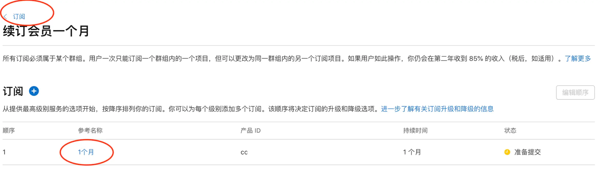

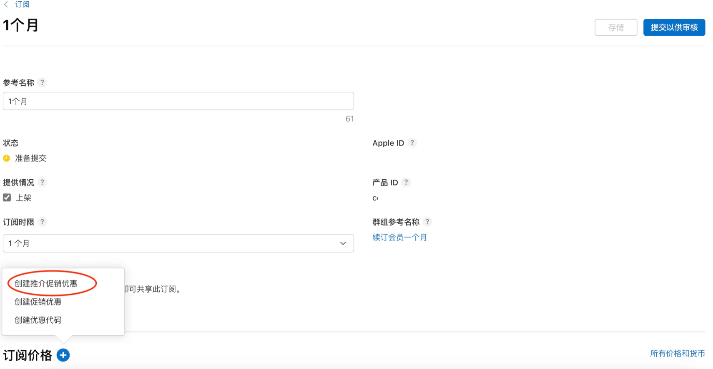

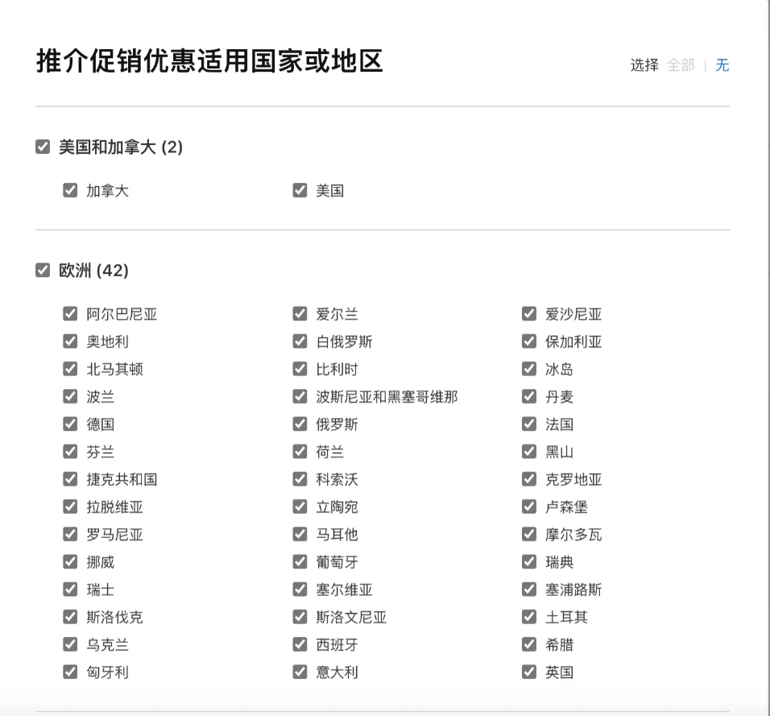

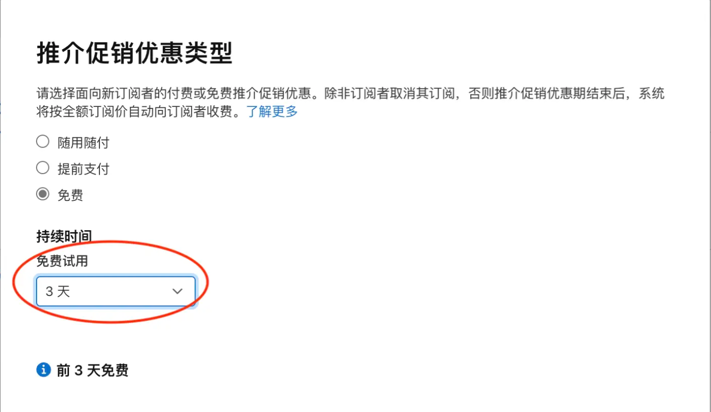

**促销优惠商品购买视图，有免费试用等字样，并注明首次扣费日期；**

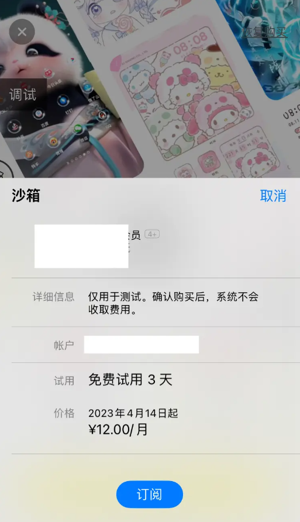

### 5.4、促销优惠测试

**沙盒账号：需要一个没有购买过当前优惠促销商品的沙盒测试账号，或者购买过的账号需要去手机【设置】-【App Store】- 沙盒账号【管理】-【重设优惠资格】**

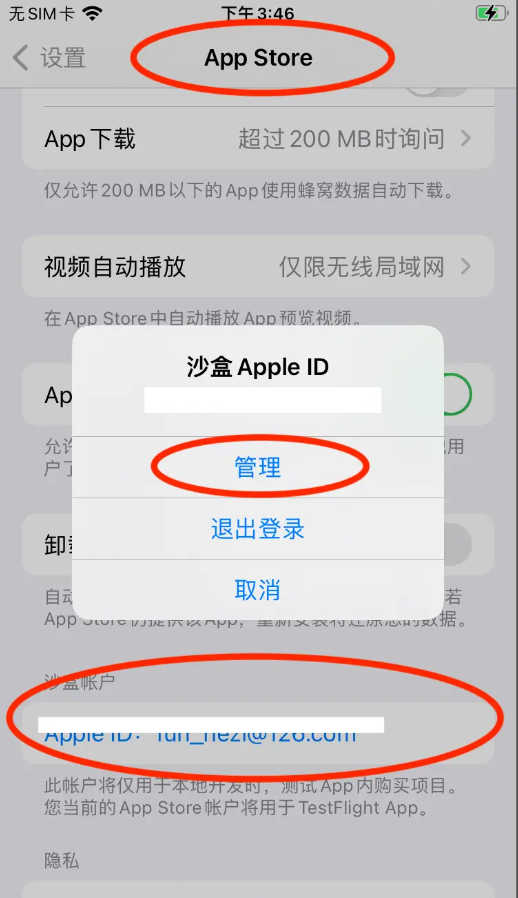

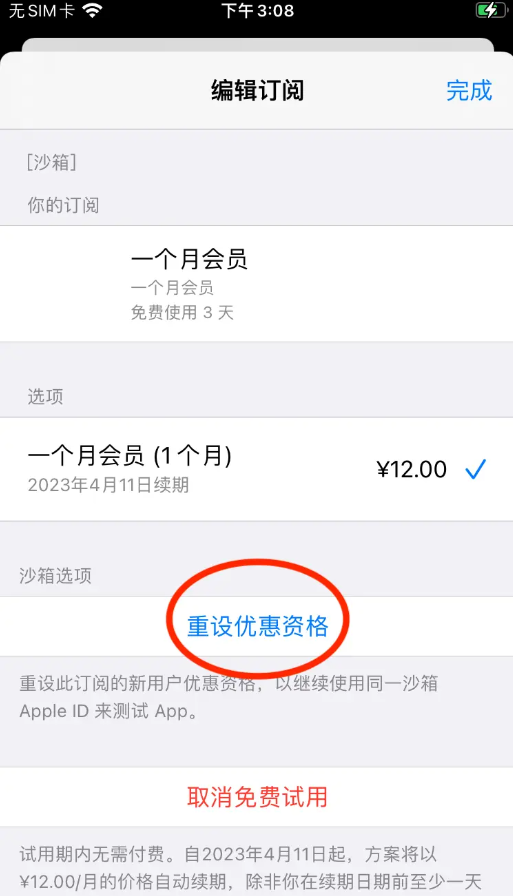

## 6、退款

[退款申请地址](https://link.juejin.cn/?target=https%3A%2F%2Freportaproblem.apple.com%2F)，退款申请可申请半年内的付费订单

**用户可以就已经购买的项目发起退款，我们需要在** **[appstoreconnect.apple.com/](https://link.juejin.cn/?target=https%3A%2F%2Fappstoreconnect.apple.com%2F)** **后台，App信息处，配置退款的回调地址，回调处理逻辑由后端人员接入**

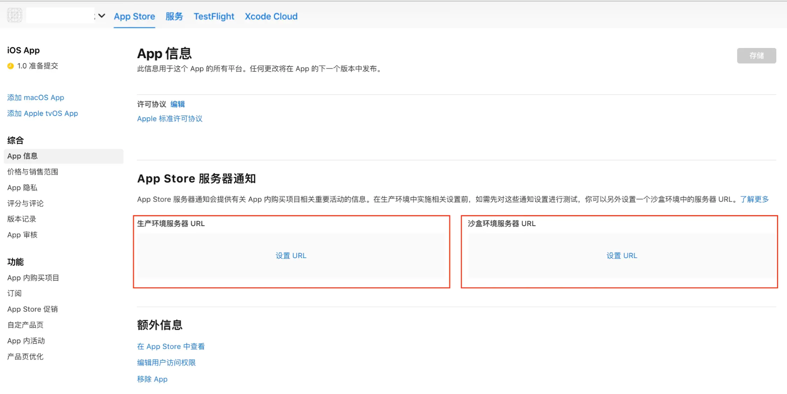

**『消耗型』『非消耗型』『非续期订阅型』退款：**

**[Apple官方退款文档[后端技术人员接入\]](https://link.juejin.cn/?target=https%3A%2F%2Fdeveloper.apple.com%2Fcn%2Fdocumentation%2Fstorekit%2Fin-app_purchase%2Fhandling_refund_notifications%2F)**

**『订阅型』退款：**

**[Apple官方退款文档[后端技术人员接入\]](https://link.juejin.cn/?target=https%3A%2F%2Fdeveloper.apple.com%2Fdocumentation%2Fstorekit%2Fin-app_purchase%2Foriginal_api_for_in-app_purchase%2Fsubscriptions_and_offers%2Fhandling_subscriptions_billing%3Flanguage%3Dobjc)**

## 三、上架

## 1、内购拒审反馈

①、提审包含【非消耗型】商品的，必须在购买页面上展示『恢复购买』按钮，并实现其功能。

②、Guideline 2.1

##### 提审时，只有有非续期订阅型商品（不支持恢复购买，UI界面上没有恢复购买功能的）可增加一段关于这些商品，如何管理、恢复这些用户购买的权益。否则容易收到Apple的审核邮件反馈:

③、在Apple商品创建的后台，商品截图上的信息，价格，购买的权益，必须与App内展示的一致。不要后台配置了价格下发，让Apple审核人员看到价格都不一样，不行。

④、Guideline 3.1.2

##### 提审时商品里有订阅型商品、促销优惠：

##### 1、需要标注促销内容，和促销期过后怎么收费，比如：当用户选到某个促销商品时，需要展示文案：前3天免费试用，试用结束后续费订阅99元/年，可随时取消订阅。确保优惠按钮从属文案里必须有优惠结束后自动扣费标准。

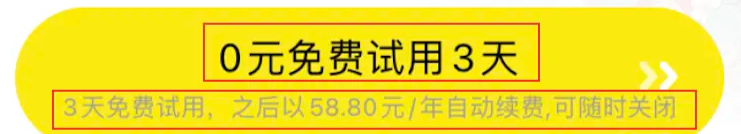

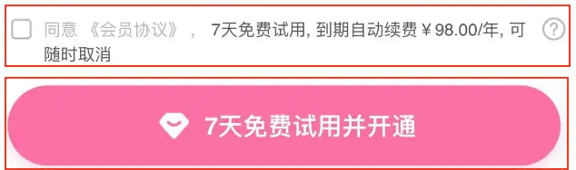

##### 在页面上展示隐私协议、会员协议、自动续费协议，协议内和应用描述文案里需要包含（也可以参考腾讯、爱奇艺那些App）：

自动订阅服务说明

（1）订阅服务：xxxxVIP连续包月(1个月)、xxxx VIP连续包年(12个月)

（2）订阅价格：xxxxVIP连续包月(1个月)为每月19.8元，连续包年产品为30元/年，具体价格会根据不同期活动优惠调整，以应用内实际展示为准

（3）付款：用户确认购买并付款后计入iTunes账户

（4）自动续费：苹果iTunes账户会在到期前24小时内扣费，扣费成功后订阅周期顺延一个订阅周期

（5）关闭服务：您可以在苹果手机“设置”-->进入“iTunesStore与AppStore”-->点击“AppleID”选择"查看AppleID"，进入"账户设置"页面，点击“订阅”，管理自动订阅服务，如需取消，每个计费周期结束前24小时关闭即可，到期前24小时内则不再扣费

## 
