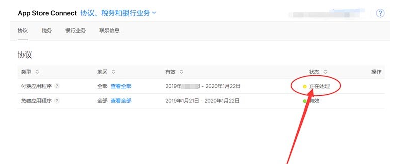

# Appstore内购接入流程

## 一、准备工作

## 1.注册开发者账号

首先，开发者需要在苹果官网注册一个开发者账号。注册成功后，开发者需要创建一个App ID，并开启支付功能。

创建证书，bundleid相关信息

apple store 地址：https://appstoreconnect.apple.com/login

苹果官方帮助：https://help.apple.com/app-store-connect/?lang=zh-cn#/devb57be10e7

## 2.填写税务，协议，银行业务相关信息

### 在appstoreconnect中心找到协议、税务和银行业务

点击进入协议、税务和银行业务 版块，进行下一步的申请

可以看到，默认的【免费应用程序】是和账号的到期时间是一致的！

而【付费应用程序】则需要“同意条款”

点击右侧“查看并同意条款

### 在弹出界面输入您的真实联系地址

该地址信息请您认真并真实填写！

提示：地址必须是全英文，可以是拼音，如果地址太长可以分2行填写

（注意：这里名称和地址总是报错，说什么参数太长，要注意修改下，之前减少了很多，都不行，后来又突然可以了）

点击【同意】完整地址信息提交！

### 地址信息更新之后，跟着设置“税务、银行业务和联系信息”

点击右侧【税务、银行业务和联系信息】进入设置页面

在设置页面，点击添加【银行账号】

>温馨提示：个人用户在账户持有人姓名哪里输入拼音；公司用户输入邓白氏编码一致的公司英文名！
>按照自己的真实信息填写，公司就写公司，个人就写个人！
>这里需要一个CNAPS，是大陆地区每个银行的银联收款号，请电话至您账号的开户行询问！
>当然也可以在线查询！前提是你知道自己的开户行详细信息！
>
>强烈建议：还是建议电话至开户行询问银联12位编码（支付系统行号）！
>
>[在线查询](https://www.lianhanghao.com/)

输入信息齐全之后，下拉，勾选协议，点击右侧【添加】即可完成

如图，银行信息就设置好了。

### 设置税务协议，美国税务协议！

直接点击【完成】选择美国协议！

当然如果你账号是以下三个国家或中国台湾省的，可以单独勾选，独立填写！

您是否被视为美国税务居民 (U.S. Tax Resident) ？

一般来说，如果您符合以下条件，则您可被视为美国居民：(1) 在本日历年的任何时间，根据美国移民法，您是美国合法永久居民，该身份未撤销，且未从行政或司法角度认定为已放弃该身份；或者 (2) 您在本年度内至少在美国实际居留 31 天，在包含本年度及前两年在内的总计 3 年期内在美国实际居留至少 183 天。点按此处进一步了解“美国居民”的定义。

您在美国是否有任何商业活动？

一般来说，如果您在美国有雇员，或在美国拥有、租用或控制设备或其他资产，并且使用这些资产通过 Apple 赚得收入，则表示您在美国有商业活动。

直接选择【否】即可点击【提交】

### 填写详细税务协议单

Certificate of Foreign Status of Beneficial Owner

受益所有人的外国身份证明

1. Individual or Organization Name
   个人或公司组织名 系统默认
2. Country of Incorporation
   地区或国家 系统默认 中国大陆
3. Type of Beneficial Owner

受益人类型 自行选择，公司就选公司，个人选个人

1. Permanent Residence

常住地 系统默认（如不正确，请在第一项地址里面修改）

1. Mailing Address

邮寄地址 系统默认 （如不正确，请在第一项地址里面修改）

Certification
I declare that the individual or organization named above is the beneficial owner of any payments made under the agreement. I declare that the beneficial owner does not have any employees in the United States and does not own, lease, or control any equipment or other assets in the United States that are used to derive revenue from Apple. I declare that I am either the beneficial owner or that I am authorized to make this declaration on behalf of the beneficial owner.
Name of Person making this Declaration

以上信息正确，请注意勾选此处协议！

Title ：输入框

—— 职位签名，英文名 +CEO 总经理 …

W-8BEN-E 代用表
Certificate of Status of Beneficial Owner for United States Tax Withholding and Reporting (Entities) (Rev. July 2017)

我们建议您在填写 W-8BEN-E 代用表之前先查看 W-8BEN-E 代用表提示页和 W-8BEN-E 报税表说明。

如果您之前提交过 W-8BEN-E 代用表，则您现在填写的 W-8BEN-E 代用表将替换并取代您之前提交的 W-8BEN-E 代用表。

如果您是合伙公司，并且希望通过 Apple Developer Program 申请与您的收入相关的协定利益，请参阅有关提交更新的税务信息的常见问题解答。

该部分可以全部留空！

Part III: Claim of Tax Treaty Benefits (If Applicable). (For chapter 3 purposes only)
\14. I certify that (check all that apply)
The beneficial owner is a resident of China mainland within the meaning of the income tax treaty between United States and that country.
The beneficial owner derives the item (or items) of income for which the treaty benefits are claimed, and, if applicable, meets the requirements of the treaty provision dealing with limitation on benefits. The following are types of limitation on benefits provisions that may be included in an applicable tax treaty (check only one; see instructions):
Type of limitation on benefits provisions

The beneficial owner is claiming treaty benefits for dividends received from a foreign corporation or interest from a U.S. trade or business of a foreign corporation and meets qualified resident status (see instructions).
\15. Special rate and Conditions
The beneficial owner is claiming the provisions of Article and paragraph
Optional
of the treaty identified on line 14a above to claim a
Optional
% rate of withholding on (specify type of income):

Income from the sale of applications
Other (please specify)
Optional

该部分可以全部留空！

最后勾选协议，底部两处勾选，之后在顶部右边上角【提交】按钮，点击提交！

提交之后耐心等待1-3工作日，如果有特殊需求，苹果会邮件通知，根据邮件修改一下即可！

## 3.App 内购买项目配置流程

官方文档：https://help.apple.com/app-store-connect/?lang=zh-cn#/devb57be10e7

登录app store connect：https://appstoreconnect.apple.com/

### 从“我的 App”中，选择您的 App。

选择“消耗型项目”、“非消耗型项目”或“非续期订阅”，并点按“创建”。有关自动续期订阅的信息，请参见创建[自动续费订阅](https://developer.apple.com/help/app-store-connect/measure-app-performance/overview-of-reporting-tools)。

### 3.1 消耗型、非消耗型商品创建

### 3.2 订阅型商品创建

#### 3.2.1 自动续期订阅

**一个群组内的商品，支持升级降级订阅，同组内同时只会订阅一个商品。**

**比如说，组内有3个商品，1个月会员，6个月会员，1年会员，用户可以在这个组内升降级修改订阅商品，最终扣费以最后一个订阅的扣费。**

**N个组内的商品，可以同时订阅N个商品。**

| 订阅群组     | 组内商品            | 用户订阅的                            |
| ------------ | ------------------- | ------------------------------------- |
| 组A          | 商品A，商品B，商品C | 订阅A/B/C                             |
| 组B          | 商品E，商品F，商品G | 订阅E/F/G                             |
| 用户总共订阅 |                     | A/B/C 和 E/F/G 【同时订阅了两个商品】 |

#### 3.2.2 自动订阅群组商品升降级说明

**在同一群组创建商品的时候，需要注意升降级跨级问题，从提供最高级别服务的选项开始，按降序排列你的订阅。**

| 商品等级升降 | 说明                                                         |
| ------------ | ------------------------------------------------------------ |
| 升级         | 从较低等级的订阅切换到较高等级的订阅时，用户先前的 App 内购买项目金额将会按比例退还到原始付款方式。新的 App 内购买项目将收取完整价格并立即生效，用户的续期日期也随之更改为升级日期。 |
| 降级         | 用户从较高等级的订阅切换到较低等级的订阅时，在下一个续期日期，会以新费率向用户收费。 |
| 跨级         | 在相同等级的订阅间进行切换时，如果 App 内购买项目的时限相同，那么用户先前的 App 内购买项目金额将会按比例退还到原始付款方式。新的 App 内购买项目将收取完整价格并立即生效，用户的续期日期也随之更改为升级日期。如果 App 内购买项目的时限不同，那么跨级将会在用户的下一个续期日期生效。 |

举个栗子：

#### 3.2.3 非自动续期订阅

### 3.3 商品详细信息编辑

>  无论是订阅还是App内购项目都需要完善商品详细信息

全部填写完成后点击右上角的存储

点按“存储”或“提交以供审核”。

您可以在创建您的 App 内购买项目时输入所有的元数据，或稍后输入您的 App 内购买项目信息。

> 注意：创建app内购买项目时有时候会报`元数据缺失`的问题，这时候点进去看下，缺什么数据：一般是价格和审核图片忘记传，填上即可。

创建完之后，一个价格就对应一个产品ID，这个产品ID就是后面你写代码需要用到的。

配置完app内购买项目之后，还有提交 App 内购买项目：https://developer.apple.com/help/app-store-connect/manage-submissions-to-app-review/submit-for-review

## 4.配置沙箱测试账号

沙盒环境说明：

1、必须是真实设备才能测试内购，模拟器不行；

2、如果设备安装的是adhoc包，xcode直接run的包，测试时需要登录沙盒测试员账号进行购买，审核人员审核时候的支付也都是使用沙盒环境（此处关系到验签）。

3、TestFlight里安装的包，也是使用沙盒环境，但是使用真实的Apple ID进行购买，不会扣钱。

#### 4.1、增加沙盒人员

#### 4.2、清除购买历史，删除沙盒人员

#### 4.3、修改自动续期测试时间

## 5.配置服务器通知地址

 **配置好服务端与苹果交互的回调地址，才能实现支付流程服务端与苹果的通讯，比如：购买验单回调，订阅续订回调，退款回调。**

## 二、具体实现

### Unity官方插件

## 三、打包测试

## 四、示例演示（沙盒环境和正式环境）

## 五、支付验证
