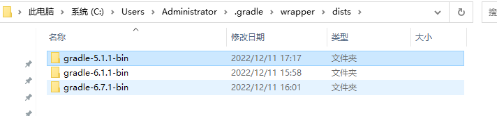
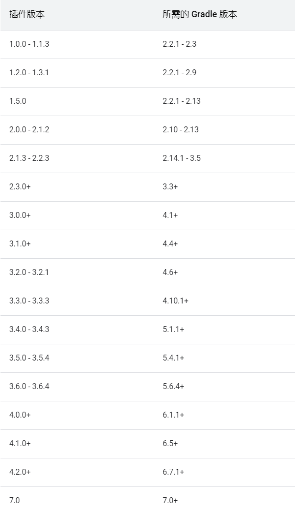
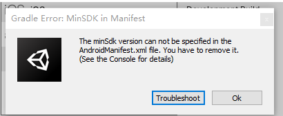
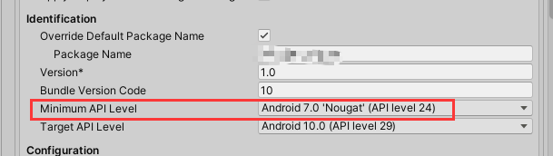
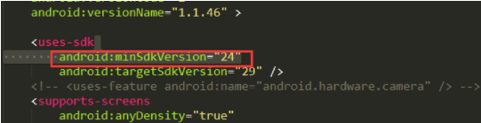

Unity2019升级到Unity2020.3.41f

### 1 .报错Could not resolve all artifacts for configuration ‘:classpath’.

可能是Gradle版本问题，Unity每个版本都对应指定的Gradle及其工具的版本。
Gradle的安装路径，默认是在C:Users.XXX .gradle.wrapper.dists路径里面：

若C盘里没有.gradle文件夹，即unity打包时没有生成，一般Unity第一次打包会自动下载指定版本放到此位置。如果有，可能版本不对，剪切到其他文件夹备份一下，然后让unity重新下载一次。

Gradle的配置文件在引擎安装路径`D:\Program Files\Unity 2020.3.41f1\Editor\Data\PlaybackEngines\AndroidPlayer\Tools\GradleTemplates`下，如果下载很慢，可以在里面修改下载路径成国内镜像地址。
国内阿里镜像：https://developer.aliyun.com/mvn/guide

网上很多自己搜 “unity配置gradle”，如：https://www.jianshu.com/p/0562b768fdff
Gradle插件版本必须和Gradle版本对应起来，可查看Gradle官方的对应关系。

### 2.报错 Gradle Error: MinSDK in Manifest

这是由于安卓端导出aar时，设置了sdk最低版本，而Unity设置的最低sdk版本比安卓要求的最低版本要低。

**解决办法**：直接删除清单文件中的minSdkVersion，取消最低版本设置要求，同时unity的MiniMumAPI Level选项设置到此APL level。

### 3.报错 Minimum supported Gradle version is 5.4.1. Current version is 5.1.1

更换Gradle所使用的版本，必须等于或大于5.4.1

### 4. failed processing manifest

**解决方案**：在gradle.properties添加代码：
android.enableAapt2=true

### 5.Execution failed for task ‘:app:mergeDebugResources’.A failure occurred while executing com.android.build.gradle.internal.tasks.Workers$ActionFacade

Android resource compilation failed

**解决方案**：在gradle.properties添加代码：
android.enableJetifier = true
android.useAndroidX = true

### 6.Error:Execution failed for task ‘:app:mergeDebugResources’.There were multiple failures while executing work items

A failure occurred while executing com.android.build.gradle.tasks.MergeResources$FileGenerationWorkAction

**解决方案**：在build.gradle的defaultConfig中添加代码：
vectorDrawables.useSupportLibrary = true

### 7.Failed to apply plugin [id ‘com.android.internal.version-check’]

**解决方案**：在gradle.properties添加代码：
android.overridePathCheck=true

### 8.Failure to initialize! Your hardware does not support this

application. Failed to load [libmain.so](http://libmain.so/)’ java.lang.
UnsatisfiedLinkError: dalvik.system.PathClassLoaderl DexPathList|(zip
file "/data/ app/ 包名-v9hxALnNbA
vIVbwOmlIHfw==/base.apk"I,nat iveLibraryDirectories=|/data/app/
包名-v9hxALnNb AvIVbwOmlIHfw==/lib/arm64,/data/
app/包名-v9hxALn NbAvIVbwOmlIHfw==/base.apk!/
lib/arm64-v8a, /system/lib64, / system/product/lib64ll couldn’t find
“[libmain.so](http://libmain.so/)” Press OK to quit.