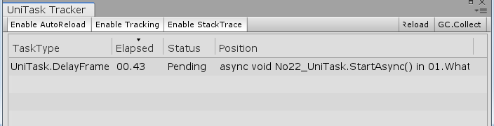

> 什么是UniTask
> 一般什么情况下使用UniTask
> UniTask和UniRx什么关系
> UniTask API
> UniTaskTracker 可视化任务

------

##### 什么是UniTask

UniTask 功能依赖于 C# 7.0( task-like custom async method builder feature ) 所以需要的 Unity 版本是之后Unity 2018.3，官方支持的最低版本是Unity 2018.4.13f1
但并不如UniRx项目提供的更为轻量级，可是UniTask拥有强大的async/await和unity进行交互。

------

##### 一般什么情况下使用UniTask

一般来说首先想到的是网络相关的处理和资源加载需要用UniTask来处理，使用UniRx来处理感觉不够用；还有复杂的运算也可以使用UniTask，当作一个线程来使用就好。

------

##### UniTask和UniRx什么关系

没有任何关系，名字比较相似，作者可能认识吧？UniRx并不依靠UniTask来进行异步，UniTask没有UniRx一样可以使用；两种作用不同的解决方案，一个针对多任务处理，一个基于微异步的游戏内容；在GitHub上也是两个解决方案，UniRx的包中有集成UniTask
[UniRx](https://github.com/neuecc/UniRx)
[UniTask](https://github.com/Cysharp/UniTask)

------

##### UniTask API

**基于Unity AsyncOperation拓展的async&awaitAPI**

所有Unity中的异步AsyncOperation都可以使用await来等待异步结果，包括AsyncLoadScene、AsyncLoadAsset、AsyncOperation

```
public class No22_UniTask : MonoBehaviour
{
    async void StartAsync()
    {
        // 加载资源
        var load = await Resources.LoadAsync<TextAsset>("1");
        // 加载场景
        await SceneManager.LoadSceneAsync("SampleScene")
        .ConfigureAwait(Progress.Create<float>(p => Debug.LogFormat("p:{0}", p)));
        // 网络请求
        UnityWebRequest req = UnityWebRequest.Get("http://www.baidu.com");
        var op = await req.SendWebRequest();
    }
    
    void Start()
    {
        StartAsync();
    }
}
```

**UniTask API**

> UniTask.WaitUntil
> UniTask.WaitWhile
> UniTask.WaitUntilValueChanged
> UniTask.SwitchToThreadPool
> UniTask.SwitchToTaskPool
> UniTask.SwitchToMainThread
> UniTask.SwitchToSynchronizationContext
> UniTask.Yield
> UniTask.Run
> UniTask.Lazy
> UniTask.Void
> UniTask.ConfigureAwait
> UniTask.DelayFrame
> UniTask.Delay(…, bool ignoreTimeScale = false, …) parameter

------

**UniTask.WaitUntil**
一直等待直到达到某种条件，才执行下面的代码

```
public class No22_UniTask : MonoBehaviour
{
    private bool mValue;

    async void StartAsync()
    {
        Debug.LogFormat("frame start:{0}", Time.frameCount);
        Observable.TimerFrame(100).Subscribe(_ => mValue = true);

        // 一直等待直到达到某种条件，才执行下面的代码
        await UniTask.WaitUntil(() => mValue == true);
        Debug.LogFormat("frame end:{0}", Time.frameCount);
    }
    
    void Start()
    {
        StartAsync();
    }
}
```

------

**UniTask.WaitWhile**
当达到某种条件才进行等待，条件失败通过

```
public class No22_UniTask : MonoBehaviour
{
    private bool mValue;

    async void StartAsync()
    {
        Debug.LogFormat("frame start:{0}", Time.frameCount);
        Observable.TimerFrame(100).Subscribe(_ => mValue = true);

        // 当达到某种条件才进行等待，条件失败通过
        await UniTask.WaitWhile(() => mValue == false);
        Debug.LogFormat("frame end:{0}", Time.frameCount);
    }
    
    void Start()
    {
        StartAsync();
    }
}
```

------

**UniTask.WaitUntilValueChanged**
一直等待直到值有变化了之后才之执行后面的代码

------

**UniTask.SwitchToThreadPool**
之后的代码运行在线程池中

```
public class No22_UniTask : MonoBehaviour
{
    private bool mValue;

    async void StartAsync()
    {
        Debug.LogFormat("frame start:{0}", Time.frameCount);
        Observable.TimerFrame(100).Subscribe(_ => mValue = true);

        //之后的代码运行中线程池中
        await UniTask.SwitchToThreadPool();
        // 当达到某种条件才进行等待，条件失败通过
        await UniTask.WaitWhile(() => mValue == false);
        Debug.LogFormat("frame end:{0}", Time.frameCount);
    }
    
    void Start()
    {
        StartAsync();
    }
}
```

------

**UniTask.SwitchToTaskPool**
之后的代码运行在任务池中

------

**UniTask.SwitchToMainThread**
*之后的代码运行在主线程中

------

**UniTask.SwitchToSynchronizationContext**
之后的代码运行在同步句柄中

------

**UniTask.Yield**
相当于yiled return [operation]

```
public class No22_UniTask : MonoBehaviour
{
    async void StartAsync()
    {
        Debug.LogFormat("frame start:{0}", Time.frameCount);
        // PlayerLoopTiming.PostLateUpdate  =  WaitForEndOfFrame
        // yield return null
        // yield return WaitForFixedUpdate
        await UniTask.Yield(PlayerLoopTiming.PostLateUpdate);
        Debug.LogFormat("frame end:{0}", Time.frameCount);
    }
    
    void Start()
    {
        StartAsync();
    }
}
```

------

**UniTask.Run**
启动一个标准的线程

```
public class No22_UniTask : MonoBehaviour
{
    async void StartAsync()
    {
        Debug.LogFormat("frame start:{0}", Time.frameCount);
        // 启动一个标准的线程
        await UniTask.Run(() => Debug.Log("heavy task heavy cal"));
        Debug.LogFormat("frame end:{0}", Time.frameCount);
    }
    
    void Start()
    {
        StartAsync();
    }
}
```

**UniTask.Lazy**
启动一个回调线程

```
public class No22_UniTask : MonoBehaviour
{
    private UniTask<int> mLazy;
    async void StartAsync()
    {
        Debug.LogFormat("frame start:{0}", Time.frameCount);
        // 启动一个回调线程
        await UniTask.Lazy<int>(() => UniTask.DelayFrame(100));
        Debug.LogFormat("frame end:{0}", Time.frameCount);
    }
    
    void Start()
    {
        StartAsync();
    }
}
```

------

**UniTask.Void**
void回调辅助方法

```
public class No22_UniTask : MonoBehaviour
{
    async void StartAsync()
    {
        Debug.LogFormat("frame start:{0}", Time.frameCount);
        // void回调辅助方法
        UniTask.Void(Method);
        Debug.LogFormat("frame end:{0}", Time.frameCount);
    }

    private UniTask Method()
    {
        return UniTask.DelayFrame(100);
    }

    void Start()
    {
        StartAsync();
    }
}
```

------

**UniTask.ConfigureAwait**
基于AsyncOperation的拓展配置

```
public class No22_UniTask : MonoBehaviour
{
    async void StartAsync()
    {
        Debug.LogFormat("frame start:{0}", Time.frameCount);
        // 基于AsyncOperation的拓展配置
        Resources.LoadAsync<TextAsset>("1").ConfigureAwait(Progress.Create<float>(p => Debug.LogFormat("p:{0}", p)));
        Debug.LogFormat("frame end:{0}", Time.frameCount);
    }

    private UniTask Method()
    {
        return UniTask.DelayFrame(100);
    }

    void Start()
    {
        StartAsync();
    }
}
```

------

**UniTask.DelayFrame**
延时指定的帧数执行下面的代码

------

**UniTask.Delay(…, bool ignoreTimeScale = false, …) parameter**
延时指定的时间执行下面的代码

------

**UniTaskTracker 可视化任务**
使用UniTask的监视器，可以监视当前执行的哪些任务

Enable AutoReload：是否允许自动加载task
Enable Tracking： 是否允许跟踪task
Enable StackTrace：是否允许堆栈跟踪
Reload：重新加载task列表
GC.Collect：进行GC回收